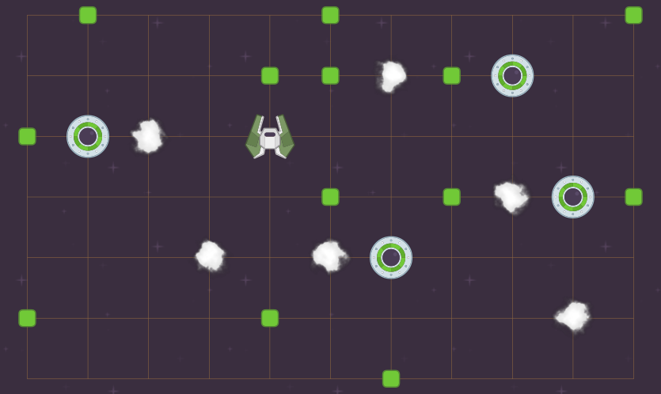

= spacegrid III.
:toc:
:note-caption: :information_source:
:warning-caption: :warning:

== Zadání

Vaším úkolem za 5 bodů je vytvořit pomocí PyQt5 grafické uživatelské rozhraní, které
umožní vizualizovat a editovat vesmírnou mřížku. Můžete samozřejmě vyjít z práce na cvičení,
ale zbývá toho poměrně dost dodělat. Rozhraní umožní:

* vytvářet novou mřížku zadaných rozměrů (prázdnou, náhodně generovanou apod., jak chcete)
* ukládat a načítat mřížku ve formě NumPy matic do/ze souborů dle volby uživatele
** pokud se to nepovede, musí aplikace zobrazit chybové hlášení v grafické podobě (tj. ne jen do konzole)
** formát souborů viz níže
* prohlížet mřížku v grafické podobě
** včetně všech objektů v ní a vizualizace nejkratší cesty ze zvoleného uzlu (viz níže)
** pokud se mřížka celá nevejde do okna, musí mít posuvníky (jako na cvičení)
** zoom (např. *Ctrl* + kolečko myši) není nutný, ale je příjemný
* klást na mřížku objekty (uzly, stanice, singularity) a odebírat je (tyto změny se projeví v paměti na úrovni NumPy matice)
* nabídka *Help* > *About* vyvolá okno s informacemi o aplikaci:
** název
** stručný popis
** autor/autoři (vy, případně i my, pokud používáte náš kód)
** odkaz na repozitář
** informace o licenci
** pokud používáte public domain grafiku z https://opengameart.org[OpenGameArt.org], nemáte právní povinnost zdroj zmínit, ale považujeme to za slušnost

Veškerou potřebnou grafiku najdete ve složce `svgs` tohoto repozitáře.
Celkové grafické zpracování je ale na vás, můžete použít jinou (např. vlastní) grafiku.

== Zobrazování cesty

* nejkratší záchrannou cestu z uživatelem zvolené pozice zobrazte pomocí obrázků čar ze složky `svgs/lines`
** vybrané políčko reprezentujte obrázkem vesmírné lodě
** tip: názvy souborů s čarami nejsou náhodné
** tip: jelikož cesta vede přes políčka, na kterých může být jiný objekt, nemůžete cestu ukládat do matice s mřížkou
* výpočet cesty máte připraven z minulých úkolů
* aplikaci nebudeme testovat s mřížkou tisíce krát tisíce jako minulý úkol, ale pro rozumné velikosti (cca do 200 na 200) výpočet musí proběhnout dostatečně svižně, aby aplikace byla použitelná
* výpočet cesty musíte provést po každé změně mřížky (vytvoření, načtení, přidání/odebrání objektu)
* z některých pozic logicky cesta nemusí existovat, od nich tedy žádnou nevykreslujte (aplikace s takovou situací musí počítat a nesmí spadnout)

== Formát souboru s mřížkou

Ukládejte a načítejte mřížku takto, umožní nám to jednodušší kontrolu:

[source,python]
----
numpy.savetxt(path, array)
array = numpy.loadtxt(path, dtype=numpy.uint8)
----

== Předchozí (stále platné) zadání

Vaším úkolem je pomocí NumPy vytvořit funkci `escape_routes(grid)` v modulu `spacegrid`.

NOTE: Referenční řešení minulé úlohy je zde v repozitáři.

Na vstupu bude dvourozměrná vesmírná mřížka uložená v matici malých nezáporných čísel.
Na uzlech mřížky se nachází vesmírné objekty (zakódované pomocí čísel v matici).

Existují 3 typy objektů zakódované pomocí těchto čísel:

- 1 znamená transportní uzel (v matici je jich libovolně mnoho)
- 2 znamená záchrannou stanici (v matici je jich libovolně mnoho)
- 3 (nebo vyšší číslo) znamená časoprostorovou singularitu (v matici je jich libovolně mnoho)

Pro doplnění:

- 0 znamená volný vesmírný prostor

Vaším úkolem je naplánovat nouzový transport posádky vaší vesmírné lodi na libovolnou záchrannou stanici tak,
aby tento transport zabral co nejméně kroků a vyhnul se časoprostorovým singularitám.
Pozice lodi v matici není zakódována, předpokládejte, že se může nacházet v libovolném uzlu mřížky.

=== Vesmírný transport

Transportní uzel může v jednom kroku odeslat transportní paprsek s posádkou do jiného transportního uzlu ležícího v libovolné vzdálenosti na přímé linii v jednom ze 4 přímých směrů (nahoru, dolu, doleva, doprava). Transport je v témže kroku přijat v daném směru nejblíže se nacházejícím transportním uzlem, který jej opět může v následujícím kroku poslat libovolným ze 4 směrů. Vesmírná loď a záchranná stanice jsou v tomto případě považovány za speciální typ transportního uzlu.
Transport nelze provést přes časoprostorovou singularitu.

Upřesnění: Souřadnicová vzdálenost transportních uzlů není směrodatná,
transport mezi dvěma uzly ležícími na přímé linii trvá vždy jeden krok,
pokud mezi nimi leží pouze volný vesmírný prostor.

Triviální příklad::
  V uzlu `[0, 0]` se nachází vesmírná loď, v uzlu `[0, 1]` se nachází záchranná stanice.
  Posádku je možné zachránit v jednom kroku (doprava).

Stále jednoduchý příklad::
  V uzlu `[0, 0]` se nachází vesmírná loď, v uzlu `[0, 1023]` se nachází záchranná stanice.
  Mezi těmito uzly je volný vesmírný prostor.
  Posádku je možné zachránit v jednom kroku (doprava).

Příklad s příliš mnoha transportními uzly::
  V uzlu `[0, 0]` se nachází vesmírná loď, v uzlu `[0, 1023]` se nachází záchranná stanice.
  Mezi těmito uzly je v každém uzlu transportní stanice.
  Posádku je možné zachránit ve 1023 krocích (doprava).

Příklad se stanicí mimo dosah::
  V uzlu `[0, 0]` se nachází vesmírná loď, v uzlu `[1, 1]` se nachází záchranná stanice.
  Posádku nelze zachránit.

Příklad se stanicí s přestupním uzlem::
  V uzlu `[0, 0]` se nachází vesmírná loď, v uzlu `[0, 1]` se nachází transportní uzel, v uzlu `[1, 1]` se nachází záchranná stanice.
  Posádku lze zachránit ve dvou krocích (doprava, dolu).

Příklad s rychlou záchranou na dalekou stanici::
  V uzlu `[0, 0]` se nachází vesmírná loď, v uzlu `[0, 1]` se nachází transportní uzel, v uzlech `[1, 1]` a `[1023, 0]` se nacházejí záchranné stanice.
  Posádku lze zachránit v jednom kroku (dolu).

Příklad s časoprostorovou singularitou::
  V uzlu `[0, 10]` se nachází vesmírná loď, v uzlu `[0, 11]` se nachází časoprostorová singularita, v uzlech `[0, 12]` a `[0, 0]` se nacházejí záchranné stanice.
  Posádku lze zachránit v jednom kroku (doleva).

NOTE: Více příkladů najdete v přiložených testech.

=== Rozhraní

Funkce `escape_routes(grid)` z modulu `spacegrid` přijme jedno dvourozměrné NumPy pole definované výše
a vrátí objekt s následujícími atributy:

atribut `distances`::
  NumPy matice vhodného celočíselného typu, kde pro každý uzel, ze kterého se dá dostat na záchrannou stanici,
  bude počet kroků k nejdříve dosažitelné záchranné stanici, jinak -1.
  Na místech se záchrannou stanicí se tedy očekává 0,
  na místech s časoprostorovou singularitu -1
  a na místech s volným vesmírným prostorem buďto -1 nebo nějaké kladné celé číslo.

atribut `directions`::
  NumPy matice typu `('a', 1)`, kde je pro každé uzel směr,
  kterým se odtud transportovat po nejoptimálnější trase na záchrannou stanici,
  jako ASCII byte `^`, `v`, `<` nebo `>`; pro záchranné stanice `+`
  a pro uzly, ze kterých se nedá na žádnou záchrannou stanici dostat, mezeru.
  V případě více rovnocenných (stejně kroků trvajících) cest na záchrannou stanici vyberte libovolnou,
  ale stejnou jako v metodě `route()` (níže).

atribut `safe_factor`::
  float reprezentující poměr uzlů, ze kterých se dá dostat na záchrannou stanici, k celkovému počtu.
  Pokud se dá z každého uzlu dostat na záchrannou stanici, výsledek je `1.0`,
  pokud se z žádného dostat nedá, pak `0.0`.
  V případě, že `grid` má nulovou velikost, je toto číslo `nan`.

metodu `route(row, column)`::
  Pro zadané souřadnice vesmírné lodi (`row, column`) vrátí
  https://docs.python.org/3/glossary.html#term-iterable[iterable]
  souřadnic (dvojic) transportních uzlů,
  přes které vede optimální (má nejméně kroků) trasa na záchrannou stanici,
  včetně souřadnic cílové záchranné stanice.
  Souřadnice musí být iterovatelné chronologicky,
  tedy končí souřadnicemi cílové záchranné stanice.
  Sekvence neobsahuje zadané souřadnice vesmírné lodi,
  v případě, že se na zadaných souřadnicích nachází záchranná stanice,
  je sekvence prázdná.
  Pro souřadnice uzlů, ze kterých se na záchrannou stanici nedá dostat,
  vyhodí výjimku `ValueError`.
  V případě více rovnocenných (stejně kroků) tras na záchrannou stanici vyberte libovolnou,
  ale stejnou jako v atributu `directions`.
  V případě, že se rozhodnete vracet generátor,
  obalte jej metodou, která zajistí vyhození výjimek v okamžiku zavolání.

V případě, že vstup není správného typu, selže funkce s patřičnou výjimkou;
pro více informací prostudujte přiložené testy.

Můžete předpokládat, že s vstupním polem se v průběhu životnosti vráceného objektu nemanipuluje.
Pokud si tedy potřebujete vstupní data uchovat, nemusíte si dělat jejich kopii.

== Automatické testy

Součástí zadání úkolu je sada automatických testů.
Jejich splnění je povinnou, nikoli však dostačující podmínkou pro splnění úkolu.

Pro spuštění testů nainstalujte do virtuálního prostředí balík `pytest-timeout` a spusťte:

[source,console]
$ python setup.py build_ext -i  # sestaví modul napsaný v Cythonu
$ python -m pytest -v tests

Testy nevyžadují žádný speciální setup, funkce `escape_routes` nemá žádné side-effecty.
Testy si doporučujeme zkopírovat k sobě do repozitáře.

NOTE: Testy hojně využívají forcykly, aby byly čitelné pro studenty neznalé pytestu.
V lekci o pytestu se neučíme psát parametrizované testy místo forcyklů a vysvětlíme si, proč je to lepší.

WARNING: Test `test_large_grid_slow` je doplněn o kontrolu na čas pomocí pluginu `pytest-timeout`.
Pokud máte slabší počítač, můžete testovat se sníženou hodnotou `BIG_ENOUGH_NUMBER`.

== Licence

Zadání této úlohy, testy i případné referenční řešení jsou zveřejněny pod licencí
https://creativecommons.org/publicdomain/zero/1.0/deed.cs[CC0].

Grafika použitá v ilustračním obrázku pochází ze https://www.kenney.nl/[studia Kenney]
a je dostupná pod stejnou licencí.

== Odevzdávání úkolu

* vytvořte si nový privátní git repozitář s názvem `spacegrid` (do něj nás pozvěte, případné kolize s existujícími repozitáři řešte e-mailem)
* na tuto úlohu budou navazovat další, všechny se budou tématicky věnovat tomuto zadání
* v repozitáři odevzdávejte pomocí tagu `v0.2`
* všechny závislosti (včetně `numpy` a `Cython`) uveďte v souboru `requirements.txt` (nemusí být s konkrétní verzí)
* z kořenového adresáře repozitáře musí jít po instalaci závislostí udělat `python setup.py build_ext -i` a poté v Pythonu `from spacegrid import escape_routes` a `escape_routes(grid)` a spustit dodané testy
